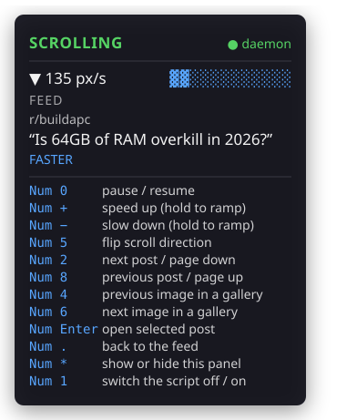

# Reddit Scroller

[](https://github.com/YokoAC/reddit-scroller/actions/workflows/tests.yml)
[](https://github.com/YokoAC/reddit-scroller/actions/workflows/tests.yml)
[](LICENSE)
[](#setup)
[](#browser-support)
[](#browser-support)
[](pyproject.toml)
[](https://github.com/astral-sh/ruff)
[](https://mypy-lang.org/)
[](https://biomejs.dev/)

Auto-scrolls a Reddit feed in your normal browser on a second monitor, driven by
global numpad hotkeys — so you can keep reading without leaving a full-screen game.



Two halves:

- A **userscript** that runs inside your real, already-logged-in Firefox or Chrome.
  It owns the scrolling, decides which post is "current", and draws the on-screen
  readout.
- A **Python daemon** that owns the global keyboard hook and hands commands to the
  userscript over `127.0.0.1`.

## Setup

**1. The daemon**

```bash
uv sync
uv run python -m reddit_scroller
```

Leave it running. It prints its bindings on start.

**2. The userscript**

1. Install Violentmonkey — for
   [Firefox](https://addons.mozilla.org/firefox/addon/violentmonkey/) or for
   [Chrome](https://chromewebstore.google.com/detail/violentmonkey/jinjaccalgkegednnccohejagnlnfdag).
   Tampermonkey works too; the script uses nothing specific to either.
2. Build the script: `cd userscript && npm install && npm run build`
3. Open the Violentmonkey dashboard → **+** → **Install from file**, and pick
   `userscript/dist/reddit-scroller.user.js`.
4. Open `https://www.reddit.com`. The HUD appears bottom-right with a green dot
   next to "daemon".

The built file is already committed, so installing it does not require the build
step — but rerun `npm run build` and reinstall the file if you change the source.

### Without the daemon

The userscript works on its own, and if you never intend to alt-tab away you can
stop after step 2 and skip Python entirely. Every key in the table below does the
same thing, handled in the page.

What the daemon adds is the one thing a page cannot do: receive those keys while
*another window* has focus. Without it the numpad goes to whatever you alt-tabbed
into, and the feed stops responding — which is the entire reason this project has
a second half.

The HUD names which of the two is driving. **`● daemon`** in green means the
daemon is; **`● browser only`** in amber means the page is, and that the hotkey
panel is showing built-in defaults rather than your `config.json`. Amber, not red:
nothing is broken in that state.

## Browser support

Firefox and Chrome both work, and both are tested: `npm run test:browser` runs the
built bundle in real Firefox and real Chromium against a real daemon, and CI runs
that suite on every push. Nothing in the page half is engine-specific, and the
daemon never learns which browser it is talking to.

One hop those tests have to substitute, so check it once on a browser you have not
used this on before: `GM_xmlhttpRequest` from an `https://www.reddit.com` page to
`http://127.0.0.1`. That request is issued by the userscript manager's extension
rather than by the page, which is what keeps it clear of mixed-content and CORS
rules — but a browser may still apply a policy of its own to extension traffic
aimed at the local network, and could prompt for it or refuse it. A green dot next
to "daemon" in the HUD means it went through.

## Controls

| Key | In the feed | In a thread |
|---|---|---|
| Numpad `0` | pause / resume scrolling | pause / resume scrolling |
| Numpad `+` / `-` | speed up / down by 15 px/s | speed up / down by 15 px/s |
| Numpad `5` | flip scroll direction | flip scroll direction |
| Numpad `8` / `2` | select previous / next post | scroll up / down a screen |
| Numpad `Enter` | open the selected post | — |
| Numpad `.` | — | back to the feed |
| Numpad `*` | show / hide the hotkey panel | show / hide the hotkey panel |

**Hold `+` or `-`** and the speed ramps continuously — the whole 15–600 px/s range
takes about a second. The other keys deliberately fire once per press, so a finger
resting on numpad `0` can't strobe the scroller.

**Numpad `5` reverses direction** rather than changing speed; the HUD's arrow (`▼` or
`▲`) always shows which way you're going, and the speed keeps its own setting.

**Opening a thread always lands paused**, at the top, so you never scroll past the
opening. Pressing `.` returns to the feed, also paused. Press `0` when you're ready.

**A page never starts scrolling on its own.** Your speed is remembered within a tab,
so opening a thread and coming back keeps it — but a new tab starts at
`default_speed` and paused. Nothing is stored beyond the tab's lifetime.

The selected post is outlined in blue and named in the HUD. While auto-scrolling it
follows whatever sits a quarter of the way down the screen; pressing `8` or `2` pins
your choice until it scrolls off.

The hotkey panel lists your *actual* bindings, read from the daemon — so it stays
correct if you rebind anything. With the daemon down it falls back to the defaults,
which are the keys the in-page handler uses anyway. It also appears by itself for six
seconds when a page loads.

Nothing is suppressed — your game still receives every one of these keys.

## Configuration

Copy `config.example.json` to `config.json` and edit. Every field is optional; anything
you leave out keeps its default.

| Field | Default | Meaning |
|---|---|---|
| `port` | `8765` | Loopback port. |
| `default_speed` | `90` | Starting scroll speed, px/s. |
| `speed_step` | `15` | Change per `faster` / `slower` press. |
| `speed_min` / `speed_max` | `15` / `600` | Speed limits. |
| `focus_line` | `0.25` | Where the "current post" line sits, as a fraction of screen height. |
| `bindings` | see above | Command → key name. |

Valid key names: `numpad0`–`numpad9`, `numpad_dot`, `numpad_plus`, `numpad_minus`,
`numpad_star`, `numpad_enter`.

Commands: `toggle`, `open`, `back`, `faster`, `slower`, `prev`, `next`, `reverse`, `help`.

`config.json` is gitignored — it's local to your machine. `config.example.json` is
the committed template.

## Troubleshooting

**The HUD says "browser only" and the keys still work.** That is the documented
fallback, not a failure — see [Without the daemon](#without-the-daemon). The keys
are being handled in the page, and they will stop the moment another window takes
focus. The daemon is not running, it is on a different port than the userscript
expects, or the browser is blocking the userscript manager's request to
`127.0.0.1` — see [Browser support](#browser-support), and check the manager's own
console for a refused or pending local-network request. Otherwise
check `uv run python -m reddit_scroller` is up and that
`PORT` at the top of `userscript/src/main.js` matches `port` in your `config.json` —
these are two independent values and changing one without the other breaks the
connection. If you change `PORT`, rebuild the userscript (`npm run build`) and
reinstall it before the change takes effect.

**Hotkeys work on the desktop but not in the game.** Windows will not deliver hooked
keys from an elevated window to a non-elevated process. Run the daemon from an
Administrator terminal. Borderless-windowed mode also tends to behave better than
exclusive full-screen.

**The HUD says "no posts detected".** Reddit changed its markup and the
`shreddit-post` selector in `userscript/src/selection.js` needs updating. Scrolling
still works meanwhile.

**Nothing happens on any key.** Check the daemon's console — it logs every hotkey it
sees. If nothing appears there, the problem is the keyboard hook; if lines appear but
the page does not react, the problem is the transport.

## Development

```bash
uv run ruff check . && uv run ruff format --check .   # lint the daemon
uv run mypy                          # strict type-check the daemon
cd userscript && npm run lint        # lint and format-check the userscript

uv run pytest                        # daemon tests
uv run pytest --cov                  # ...with coverage
cd userscript && npm test            # userscript unit tests
cd userscript && npm run coverage    # ...with coverage
cd userscript && npm run test:integration   # both halves, over real HTTP
cd userscript && npm run test:browser       # the bundle in Firefox and Chromium
```

The integration suite starts the real daemon and drives the real transport
against it over HTTP, substituting only the keyboard hook. Every user-visible
bug in this project has lived in the seam between the two halves rather than
inside either one — both were well covered against hand-written stubs of each
other, which is exactly how the wire contract drifted twice with every test
still green. It needs the Python venv, so run `uv sync` first.

The browser suite answers the question jsdom cannot: whether the engines agree.
It compiles the bundle from `src`, loads it into real Firefox and real Chromium
through Playwright as a manager would, and asserts the things that depend on a
real engine — that the window actually scrolls at the configured rate, that
layout puts the selected post on the focus line, that speed survives a
navigation, and that `KeyboardEvent.code` carries the numpad names the fallback
handler expects. It needs the venv too, plus `npx playwright install`.

Playwright's Firefox build does not start on every Windows machine — it is an
unsigned, patched build, and some configurations refuse to load its private
`mozglue` assembly. If it fails there, run `npm run test:browser -- --project=chromium`
locally; the CI job runs both engines on Linux either way.

CI runs all four suites on every push: the daemon on Windows, since the hotkey
layer is built around Windows scan codes, and the rest on Linux.

[docs/architecture.md](docs/architecture.md) covers why the design is the way
it is -- long polling rather than a WebSocket, a userscript rather than an
extension, loopback with no authentication -- and the limitations that come
with those choices.

Coverage is gated on both halves -- `fail_under` in `pyproject.toml` and
`thresholds` in `userscript/vitest.config.js` -- and the build fails when it
slips below them. Both sit a little under what the suites actually reach, so
one awkward-to-cover line cannot break an unrelated change. That gate is the
number worth knowing, and it lives in those two files rather than being
quoted here, where nothing would keep it honest.

Two things are deliberately excluded: the hotkey listener's `start`/`stop`,
which install a real machine-wide keyboard hook, and `main.js`, which is
covered by `tests/main.test.js` but bundled into a jsdom window per test so
v8 cannot attribute it back to the source file.
Each CI run prints both coverage tables in its summary and uploads the full
HTML reports as artifacts.
